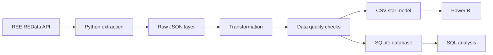

# Spain Energy Analytics

[](https://github.com/andres-olivera/spain-energy-analytics/actions/workflows/ci.yml)

End-to-end data analytics project built with public Spanish electricity data from **Red Eléctrica de España (REE)**. The repository demonstrates the complete path from a REST API to an analytics-ready data model, SQL analysis, automated tests, CI, reproducible visualizations, and a four-page Power BI dashboard.

## What this project demonstrates

- REST API consumption with retries, timeouts, and reproducible monthly extraction.
- ETL design in Python with a raw layer and a modeled analytics layer.
- Data quality checks before loading.
- A compact star-style model for SQL and BI.
- SQLite for zero-setup analytical querying.
- SQL business analysis.
- Unit and integration tests with deterministic fixtures.
- GitHub Actions CI.
- Reproducible matplotlib portfolio figures.
- Interactive Power BI reporting with synchronized date filters and page navigation.

## Validated 2025 portfolio run

| Dataset | Resolution | Observations | Coverage |
|---|---:|---:|---|
| Demand | Hourly | 8,760 | 1 Jan–31 Dec 2025 |
| Generation | Daily | 4,549 | 1 Jan–31 Dec 2025 |
| PVPC price | Hourly | 8,760 | 1 Jan–31 Dec 2025 |
| **Total** | — | **22,069** | **365 days** |

## Architecture



## Power BI dashboard

The Power BI report uses the modeled CSV layer with one-to-many relationships from `dim_date` and `dim_indicator` into `fact_observation`. The report includes synchronized date filtering and a page navigator across four pages.

### Overview


### Demand and generation

<table>
<tr>
<td width="50%"></td>
<td width="50%"></td>
</tr>
</table>

### Prices


The report contains:

1. **Overview** — observation count, average demand, average PVPC, total generation, date-range filtering, and headline trends.
2. **Demand** — daily demand evolution, average demand by local hour, and weekday/weekend comparison.
3. **Generation** — daily total generation, average generation by technology, and monthly generation by technology.
4. **Prices** — daily PVPC evolution, average PVPC by local hour, and monthly average PVPC.

The `.pbix` file is kept local and excluded from Git. The complete build specification and DAX measures are documented in [`dashboard/README.md`](dashboard/README.md).

## Data source

The source is REE's public **REData API**:

- Documentation: https://www.ree.es/en/datos/apidata
- Base API: https://apidatos.ree.es

| Project dataset | REData category / widget | Resolution |
|---|---|---|
| `generation` | `generacion/estructura-generacion` | daily |
| `demand` | `demanda/evolucion` | hourly |
| `price` | `mercados/precios-mercados-tiempo-real` | hourly |

## Data model

```text
             dim_indicator
                  1
                  |
                  | indicator_key
                  |
                  *
          fact_observation
                  *
                  |
                  | date_key
                  |
                  1
               dim_date
```

## Quick start

```bash
git clone https://github.com/andres-olivera/spain-energy-analytics.git
cd spain-energy-analytics
python -m venv .venv
```

On Windows:

```powershell
.venv\Scripts\Activate.ps1
```

Install:

```bash
python -m pip install --upgrade pip
pip install -e ".[dev]"
```

Run the complete 2025 pipeline:

```bash
python scripts/run_pipeline.py --start 2025-01-01 --end 2025-12-31 --refresh-raw
```

Run the curated SQL analysis:

```bash
python scripts/run_analysis.py
```

Regenerate static portfolio figures:

```bash
python scripts/generate_figures.py
```

## Data quality

The pipeline fails before loading if it finds:

- duplicate `(indicator_key, timestamp_local)` fact keys;
- null fact values;
- observations without a valid indicator;
- observations without a valid date dimension row.

## Tests and CI

Tests use deterministic API-shaped fixtures, so CI never depends on REE being online.

```bash
pytest --cov=spain_energy_analytics --cov-report=term-missing
```

Every push and pull request runs linting and tests on Python 3.11 and 3.12.

## Reproducibility and limitations

- REData is an external public service, so availability and widget behavior can change.
- The source `magnitude` field is not consistently populated in the live responses; raw source metadata is preserved instead of fabricated.
- Generated raw data, processed CSVs, and SQLite files are ignored by Git because they are reproducible from the public API.
- The Power BI `.pbix` is intentionally kept local; versioned screenshots document the finished report.

## Status

**Core analytics portfolio complete:** API ingestion, ETL, data quality, SQL, testing, CI, reproducible visualizations, and a four-page Power BI dashboard are implemented and validated on the full 2025 dataset.

An optional forecasting extension using external weather data remains tracked in [`ROADMAP.md`](ROADMAP.md).

## License

MIT License. See [`LICENSE`](LICENSE).
