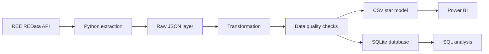

# Spain Energy Analytics

[](https://github.com/andres-olivera/spain-energy-analytics/actions/workflows/ci.yml)

End-to-end data analytics project built with public Spanish electricity data from **Red Eléctrica de España (REE)**. The repository demonstrates the complete path from a REST API to an analytics-ready data model, SQL analysis, automated tests, CI, and a Power BI-ready layer.

## What this project demonstrates

- REST API consumption with retries, timeouts, and reproducible monthly extraction.
- ETL design in Python with a raw layer and a modeled analytics layer.
- Data quality checks before loading.
- A compact star-style model for SQL and BI.
- SQLite for zero-setup analytical querying.
- SQL business analysis.
- Unit and integration tests with deterministic fixtures.
- GitHub Actions CI.
- Power BI-ready CSV tables and a documented report design.

## Business questions

The project is designed to answer questions such as:

- How does electricity demand change throughout the day?
- Is demand different on weekdays and weekends?
- Which generation technologies contribute the largest values over a period?
- How do market prices vary by month and hour?
- When do extreme price observations occur?
- How complete is the data coverage for each dataset?

## Data source

The source is REE's public **REData API**:

- Documentation: https://www.ree.es/en/datos/apidata
- Base API: https://apidatos.ree.es

The pipeline currently supports three historical-analysis widgets:

| Project dataset | REData category / widget |
|---|---|
| `generation` | `generacion/estructura-generacion` |
| `demand` | `demanda/evolucion` |
| `price` | `mercados/precios-mercados-tiempo-real` |

No API key is required for these public endpoints.

## Architecture



The API is queried in **monthly chunks**. Raw responses are persisted unchanged, transformed into dimension/fact tables, validated, exported as CSV, and loaded into SQLite.

## Data model

```text
             dim_indicator
                  1
                  |
                  | indicator_key
                  |
                  *
          fact_observation
                  *
                  |
                  | date_key
                  |
                  1
               dim_date
```

### `dim_indicator`
Metadata for every REData series, including dataset, source ID, title, magnitude, source type, and last-update information.

### `dim_date`
Reusable calendar dimension with year, quarter, month, ISO week, weekday, and weekend flag.

### `fact_observation`
One row per indicator and timestamp, with the original local timestamp, normalized UTC timestamp, value, and source percentage when available.

A key modeling decision is to preserve REData's source `magnitude` instead of silently assuming every value is MW, MWh, or EUR/MWh. See [`docs/data_dictionary.md`](docs/data_dictionary.md).

## Project structure

```text
spain-energy-analytics/
├── .github/workflows/ci.yml
├── dashboard/
│   ├── README.md
│   └── screenshots/
├── data/
│   ├── processed/
│   └── raw/
├── docs/
│   ├── architecture.md
│   ├── data_dictionary.md
│   └── decision_log.md
├── notebooks/
│   └── 01_exploratory_analysis.ipynb
├── reports/
│   ├── figures/
│   └── tables/
├── scripts/
│   ├── run_analysis.py
│   └── run_pipeline.py
├── sql/
│   ├── analysis_queries.sql
│   └── schema.sql
├── src/spain_energy_analytics/
│   ├── api.py
│   ├── config.py
│   ├── database.py
│   ├── extract.py
│   ├── pipeline.py
│   ├── quality.py
│   └── transform.py
├── tests/
├── pyproject.toml
└── requirements.txt
```

## Quick start

### 1. Clone and create a virtual environment

```bash
git clone https://github.com/andres-olivera/spain-energy-analytics.git
cd spain-energy-analytics
python -m venv .venv
```

On Windows PowerShell:

```powershell
.venv\Scripts\Activate.ps1
```

On macOS/Linux:

```bash
source .venv/bin/activate
```

### 2. Install the project

```bash
python -m pip install --upgrade pip
pip install -e ".[dev]"
```

### 3. Run the pipeline

By default, the CLI downloads the previous complete calendar year for all three datasets:

```bash
python scripts/run_pipeline.py
```

Or choose a smaller range while developing:

```bash
python scripts/run_pipeline.py --start 2025-01-01 --end 2025-01-31
```

Select only some datasets:

```bash
python scripts/run_pipeline.py --start 2025-01-01 --end 2025-03-31 --datasets demand generation
```

Use `--refresh-raw` to force re-download of raw files already present locally.

## Generated outputs

After a successful run:

```text
data/raw/<dataset>/*.json

data/processed/dim_indicator.csv
data/processed/dim_date.csv
data/processed/fact_observation.csv
data/processed/spain_energy.db

reports/data_quality.json
```

Generated data is intentionally ignored by Git because it is reproducible from the public API.

## SQL analysis

Run the curated analysis script:

```bash
python scripts/run_analysis.py
```

It prints key results and writes CSV extracts to `reports/tables/`.

The full portfolio query set is in [`sql/analysis_queries.sql`](sql/analysis_queries.sql), including:

- coverage by dataset;
- available indicators and magnitudes;
- generation ranking;
- demand by hour;
- weekday vs weekend demand;
- monthly price statistics;
- extreme price observations;
- monthly completeness checks.

## Power BI

The processed CSV files are designed for direct import into Power BI. The exact relationships, measures, and recommended report pages are documented in [`dashboard/README.md`](dashboard/README.md).

The intended report contains four pages:

1. **Overview** — coverage, dates, observation count, and slicers.
2. **Demand** — time series, hourly profile, and weekday/weekend comparison.
3. **Generation** — technology comparison and time evolution.
4. **Prices** — time series, monthly statistics, distribution, and extremes.

Screenshots will live in `dashboard/screenshots/` once the `.pbix` report is assembled in Power BI Desktop.

## Data quality

The pipeline fails before loading if it finds:

- duplicate `(indicator_key, timestamp_local)` fact keys;
- null fact values;
- observations without a valid indicator;
- observations without a valid date dimension row.

A machine-readable summary is written to `reports/data_quality.json`.

## Tests

Tests use an API-shaped local fixture, so CI never depends on REE being online.

```bash
pytest --cov=spain_energy_analytics --cov-report=term-missing
```

The suite covers:

- monthly date chunking;
- API request construction;
- REData normalization;
- calendar dimension creation;
- data-quality rules;
- SQLite loading and joins.

## CI

Every push to `main` and every pull request runs:

```text
Python 3.11 + Python 3.12
        |
        +--> install package
        +--> ruff check
        +--> pytest + coverage
```

## Reproducibility and limitations

- REData is an external public service, so availability and widget behavior can change.
- Market time granularity can evolve; the model therefore retains both hour and minute fields and does not assume all price observations are hourly.
- The source's original local timestamp is preserved and a UTC equivalent is stored to make daylight-saving transitions auditable.
- SQLite is deliberate for a portfolio project because it is portable and zero-setup. The modeled layer can later be moved to PostgreSQL or a cloud warehouse.

## Next milestone

The engineering foundation is complete. The next visual milestone is to run a full recent-year extraction, validate the resulting source magnitudes, and build the Power BI report from the modeled CSV layer.

## License

MIT License. See [`LICENSE`](LICENSE).


