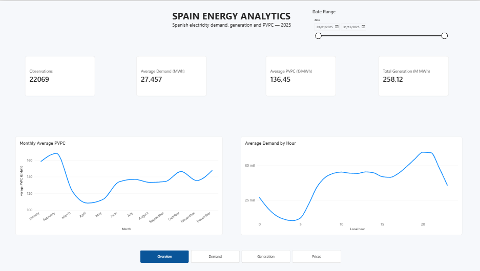
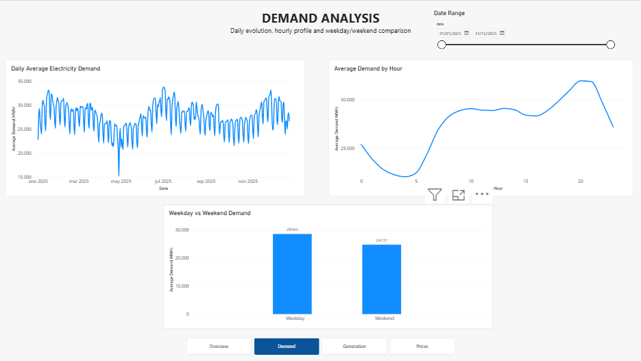
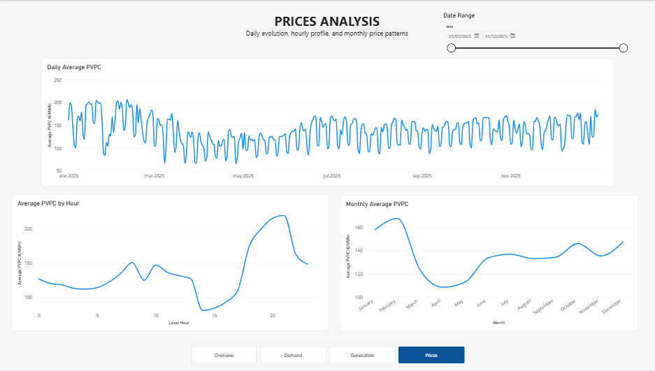

# Power BI dashboard

The report is built in Power BI Desktop from:

- `data/processed/fact_observation.csv`
- `data/processed/dim_indicator.csv`
- `data/processed/dim_date.csv`

## Model

Relationships:

1. `dim_indicator[indicator_key]` **1 -> many** `fact_observation[indicator_key]`
2. `dim_date[date_key]` **1 -> many** `fact_observation[date_key]`

Use single-direction filtering from the dimensions to the fact table and mark `dim_date[date]` as the date table.

## Import note for Spanish locales

`value` and `percentage` use decimal points in the CSV source. Import those columns as **Decimal Number** with locale **English (United States)** so Power Query parses them correctly.

## DAX measures

```DAX
Observations =
COUNTROWS(fact_observation)
```

```DAX
Average Demand (MWh) =
CALCULATE(
    AVERAGE(fact_observation[value]),
    dim_indicator[dataset] = "demand"
)
```

```DAX
Average PVPC (€/MWh) =
CALCULATE(
    AVERAGE(fact_observation[value]),
    dim_indicator[dataset] = "price"
)
```

```DAX
Total Generation =
CALCULATE(
    SUM(fact_observation[value]),
    dim_indicator[indicator_title] = "Generación total"
)
```

```DAX
Total Generation (M MWh) =
DIVIDE(
    [Total Generation],
    1000000
)
```

```DAX
Average Generation (MWh) =
CALCULATE(
    AVERAGE(fact_observation[value]),
    dim_indicator[dataset] = "generation"
)
```

Calculated column:

```DAX
Day Type =
IF(
    dim_date[is_weekend] = 1,
    "Weekend",
    "Weekday"
)
```

## Final report pages

### Overview
- KPI cards: observations, average demand, average PVPC, total generation
- Monthly Average PVPC
- Average Demand by Hour
- Synced date-range slicer
- Page navigator



### Demand
- Daily Average Electricity Demand
- Average Demand by Hour
- Weekday vs Weekend Demand



### Generation
- Daily Total Electricity Generation
- Average Daily Generation by Technology
- Monthly Generation by Technology


### Prices
- Daily Average PVPC
- Average PVPC by Hour
- Monthly Average PVPC



## Design

- canvas background: `#F6F8FB`
- visual background: `#FFFFFF`
- primary accent: `#2F80ED`
- primary text: `#1F2937`
- subtle borders: `#E5E7EB`

The date slicer is synchronized across Overview, Demand, Generation, and Prices, and a page navigator is present on the report pages.

## Reproducibility

Generate the source tables with:

```bash
python scripts/run_pipeline.py --start 2025-01-01 --end 2025-12-31 --refresh-raw
```

The validated 2025 run contains **22,069 observations across 365 dates**.
